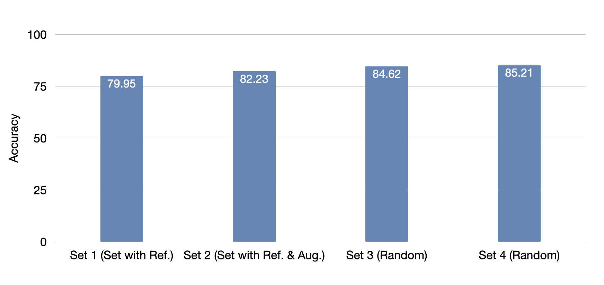

# Sharing is Caring
Code for project "Sharing is caring: share the code and data with community to improve the research".

In this project, we aim at finding out the bias between different skin colors.  


## Dataset
Our network in trained with the skin cancer images from [ISIC 2019](https://challenge2019.isic-archive.com/). Due to the unannounced labels of testing set in ISIC 2019, we only use their training set which has 25331 JPEG images of skin lesions. We seperate the data into two parts, around 19k images for our training set and 5k for the testing. 

### data augmentation
- cropping: crop the image around the center square
- grayscale: convert the image into grayscale 

## Experiments
In this code example, we use [ISIC 2019](https://challenge2019.isic-archive.com/) dataset for training and testing. ISIC 2019  has nine diagnostic categories:

1.Melanoma
2.Melanocytic nevus
3.Basal cell carcinoma
4.Actinic keratosis
5.Benign keratosis (solar lentigo / seborrheic keratosis / lichen planus-like keratosis)
6.Dermatofibroma
7.Vascular lesion
8.Squamous cell carcinoma
9.None of the others

We simplify this dataset into two catogories, benign and maglinant.

benign: catogory 1,3,8 

maglinant: catogory 2,4,5,7.

(Catogory 6 and 9 are ambiguious to be considered as benign or maglinant, so we drop them.)

To test the bias of the illumination amnong the images, we experiment on different sets of data.

Set 1 : Choose one image of dark skin as the reference image. Compute the average intensity of the reference image and each image in the dataset. If the average intensity of one image is greater than the one of reference, then the image is considered as 'training', otherwise the image considered as 'testing'.

Set 2 : Similar to Set 1, but enhanced with two methods of data augmentation. 

Set 3 : Randomly separate the whole dataset into training and testing set. The amount of the training set are the same with Set 1 and 2.

set 4 : Similar to Set 3, with a new shuffled order.

You can run 

```sh
  python labelmaker.py
```
to generate the files with lists of the image names and labels for different sets. 


To train the network, run 

```sh
  python main.py
```


The accuracy of different sets are plotted in the figure below:



We can see the small bias between the illuminations, and we can overcome the bias through data augmentation methods. However, to research on the bias between dark color skin and light color skin, the experiments require more real dark color skin images. 

## Requirements:
1. python3.6
2. tensorflow 2.0

